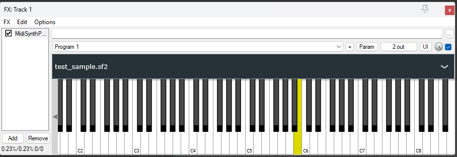

# Juce_MIDI_Plugin
## MIDI soundfonts plugin made in JUCE framework for Reaper
Plugin uses fluidfont and BinaryData to implement custom soundfonts as JUCE VST3 plugins, to implement more soundfonts check [SoundFontManager.cpp](Source/SoundFontManager.cpp).
## Screenshots

